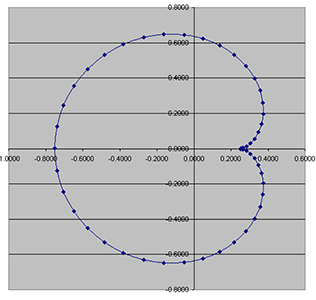

## Mandelbrot Orbits

This is a small project looking at periodic cycles / orbits in the mandelbrot set. It's an
experimental/exploratory sort of project.

I thought this was going to be a quick one weekend project and I hoped to solve the problem with
kmeans. It turns out the problem was much more complex.

Here's the final product, an image where every bulb of the mandelbrot is colored differently based
off of the periodic orbits of points in the bulb: TODO

### Table of contents
* [The Math](#the-math)
* [Rendering optimizations](#rendering-optimizations)
* [Bug Journal](#bug-journal)
## The Math

Nearly everything I've learned about the dynamics here is from a [lecture by Professor Benedetto](https://rlbenedetto.people.amherst.edu/talks/mhc_ug14.pdf)
in 2014. Huge thanks to him for making his slides available online.

TL;DR: There's actually a very straightforward algorithm for figuring out the period of a point 
in the mandelbrot set by looking at the derivative of the nth composition of .

Let  be  and let 
represent the 'th iteration of the function with constant .

I.e.:

All points  in the "main cardiod" (the big bulb) of the mandelbrot have period one orbits:
 converges to a single point as .

A period one orbit (or a fixed point) is defined as . By applying the quadratic formula
to , we can find the solutions for this equality:

Unlike real functions where one's instinct may be to say "so if this function has real
non-extraneous solutions then  is in the main cardioid," every point in the complex plane will
have solutions here regardless of whether it's in the mandelbrot set or not. The question is whether
 can ever reach one of these fixed points starting with . We can determine
whether a point will reach one of these solutions by looking at whether or not they are attractive
fixed points.

Let the multiplier  be defined as . If ,
 is an attractive fixed-point. Using this information, you can solve for all points in the main
cardiod with .

More generally, a point in an n-periodic orbit is expressed as . The smallest
integer  such that this is true is the exact period. For a point  with exact period , the
multiplier  is 

For other bulbs in the mandelbrot set with different periods, we can theoretically apply the same
solution: look for roots and test whether they are attractive. The problem is that solving for roots
of the equation  quickly becomes complicated:

Developing sufficiently advanced advanced numerical methods and algebraic manipulation ability to
find roots for these polynomials would be difficult. Even given those methods, solving for 
roots would be challenging and time consuming.

So here's the solution: Take advantage of the fact that if a point is in the mandelbrot set it will
converge on a fixed point / orbit (aka a root of ). If after iterating  a
bunch we haven't escaped then we've approximated a root for  for some value . We can
then check all points in orbit of various periods  to see if they are
attractive points.

## Rendering optimizations

## Bug Journal

Here lie a bunch of visually cool results which resulted from failed attempts at solving this
problem.
