## Mandelbrot Orbits

This is a small project looking at periodic cycles / orbits in the mandelbrot set. It's an
experimental/exploratory sort of project.

I thought this was going to be a quick one-weekend project and I hoped to solve the problem with
k-means. It turns out the problem is much more complex.

Here's the final product, an image where every bulb of the mandelbrot is colored differently based
off of the periodic orbits of points in the bulb:


### Table of contents
* [Why This Problem Is Tricky](#why-this-problem-is-tricky)
* [The Solution](#the-solution)
* [Rendering Optimizations](#rendering-optimizations)
* [A Note About Images](#a-note-about-images)
* [Bug Journal](#bug-journal)
## Why This Problem Is Tricky

I initially wanted to solve this with k-means: run a bunch of iterations to converge on an orbit
then use k-means / the silhouette method to determine how many clusters of points there are. K-means
produced some visually cool results but definitely not solving the problem as intended.


I also tried a threshold method: track previous iterations and repeatedly search for when a point
was last encountered (within some threshold). Again, cool result, but not working quite right:

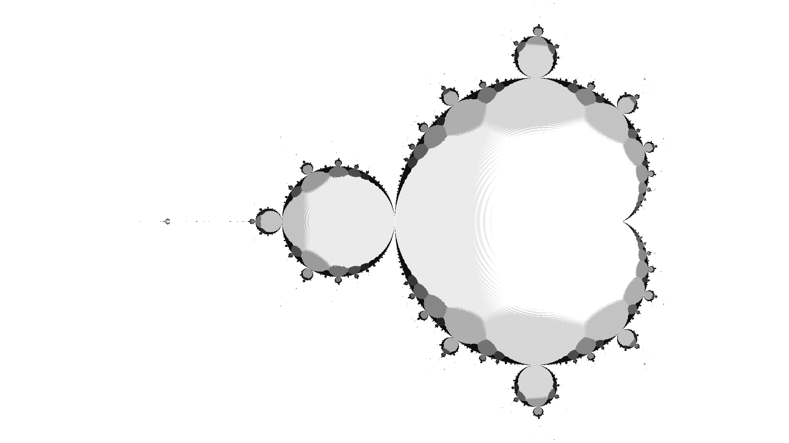

The problem here for both methods is that the trajectory of orbits, even simple period one orbits
in the main cardioid, can appear to spiral as they converge (see figure below). This is problematic
for k-means' cluster analysis as well as the threshold method: It can result in detecting a more
optimal clustering than desired for the period analysis and it can lead to the first point within
the threshold being a couple iterations behind even when the period is much lower (e.g. first point
within threshold suggests period = 5 when really period = 1).

Lowing the threshold to absurdly low levels (~10^-9) or trying to dynamically determine the
threshold, while making a difference in the image, does not do anything to address the main cardioid
(or other bulbs) not being colored properly.

There's something cool about the threshold method: The produced image does have have some value in
describing the "shape" of orbit trajectories. Darker color = more points/arms in the star/spiral
drawn by plotting the trajectory. Not what I was trying to produce but still a cool result.

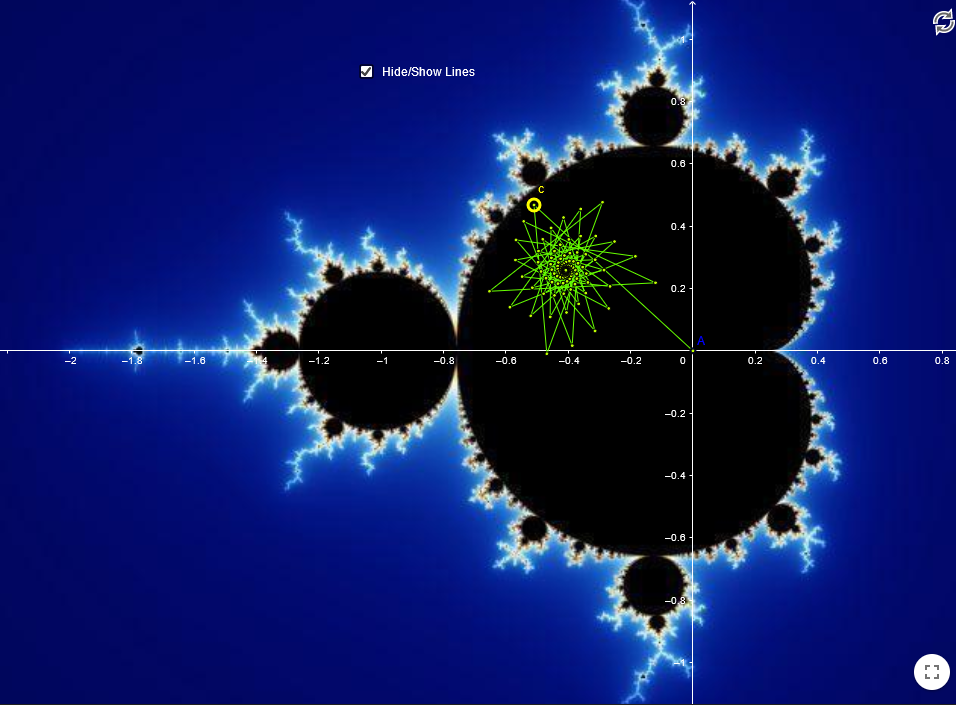
Graphic from [this](https://www.geogebra.org/m/Npd3kBKn) tool.

With both of these methods there is a lot of room for stuff to fall apart. They're both a little
hacky and susceptible to noise and flawed heuristics.

## The Solution

Nearly everything I've learned about the dynamics here is from a [lecture by Professor Benedetto](https://rlbenedetto.people.amherst.edu/talks/mhc_ug14.pdf)
in 2014. Huge thanks to him for making his slides available online.

TL;DR: There's actually a straightforward algorithm for figuring out the period of a point  in
the mandelbrot set by looking at the derivative of the nth composition of .

Let  be  and let 
represent the 'th iteration of the function with constant .

I.e.:

<p align="center"></p>

All points  in the "main cardioid" (the big bulb) of the mandelbrot have period one orbits:
 converges to a single point as .

<p align="center"></p>

A period one orbit (or a fixed point) is defined as . By applying the quadratic formula
to , we can find the solutions for this equality:

<p align="center"></p>

Unlike real functions where one's instinct may be to say "so if this function has non-extraneous
solutions then  is in the main cardioid," every point in the complex plane will have solutions
here regardless of whether it's in the mandelbrot set or not. The question is whether  can ever
reach one of these fixed points starting with . We can determine whether a point
will reach one of these solutions by looking at whether or not they are attractive fixed points.

Let the multiplier  be defined as . If ,
 is an attractive fixed-point. Using this information, you can solve for all points in the main
cardioid with .

More generally, a point in an n-periodic orbit is expressed as . The smallest
integer  such that this is true is the exact period. For a point  with exact period , the
multiplier  is .

For other bulbs in the mandelbrot set with different periods, we can theoretically apply the same
solution: look for roots and test whether they are attractive. The problem is that solving for roots
of the equation  quickly becomes complicated:

<p align="center"></p>

Developing sufficiently advanced advanced numerical methods and algebraic manipulation ability to
find roots for these polynomials would be difficult. Even given those methods, solving for 
roots would be challenging and time consuming.

So here's the solution: Take advantage of the fact that if a point is in the mandelbrot set it will
converge on a fixed point / orbit (aka a root of ). By iterating from there we
will find other roots (approximately) of the polynomial.

If after iterating  many times we haven't escaped then we've approximated a
root for . In order to find  we need to check all points in potential orbits of periods
 to see if they are attractive points.

## Rendering Optimizations

Peak-performance is not the goal of this project, but, I have been able to get very good performance
by making good use of parallelization / dynamic algorithms.

```
23m ----- Plain-old single-threaded, supersampling every pixel
 2m 42.0s Parallel, supersampling every single pixel
    15.1s Single-threaded mariani-silver, adaptive anti-aliasing
     9.9s Parallel Mariani-silver parallel, adaptive anti-aliasing
```

Parallelizing the straightforward approach of throwing compute power at every single pixel reduces
time substantially, as expected. This benchmark is from a laptop with 6 cores and 12 threads. The
reason the `2m 42s` number isn't closer to `23m / 12 threads` is due to how the problem behaves
vis-a-vis hyperthread scheduling.

The next massive performance boost comes from using a smarter algorithm for rendering the mandelbrot
and adaptively determining where anti-aliasing is needed in the image.

I've implemented the Mariani-Silver algorithm here, taking advantage of the fact that the mandelbrot
is connected. We can compute all points on the edge of a box and if they're all the same then the
entire square can be filled without spending compute time on the inside. If the edge is not uniform,
the box is subdivided. This algorithm speeds things up drastically.

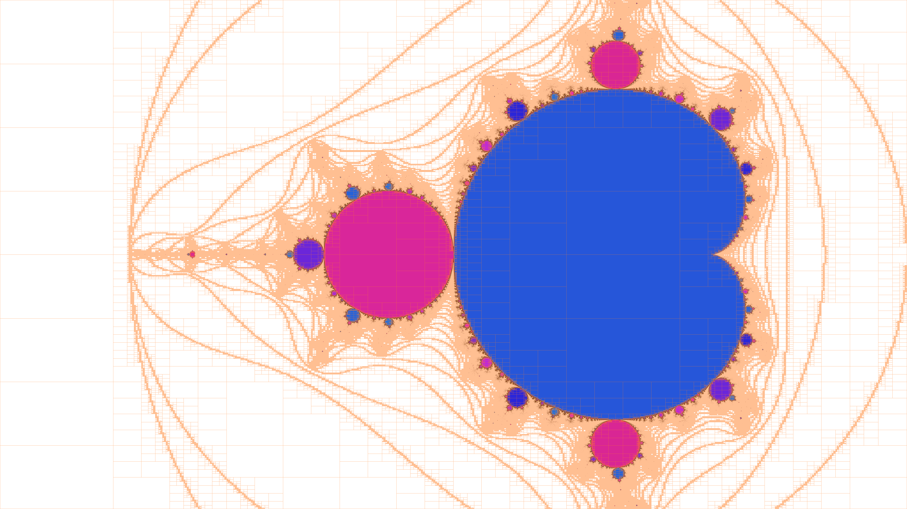

In this figure, orange pixels are the only points where computational time was expended in
discovering the mandelbrot's main body. The entire outside could be excluded but I am taking escape
time into account here so we don't miss any detail around the edge of the set. It's still super
fast.

Mariani-silver lends itself well to a depth-first recursive strategy and it's very fast with, just a
couple seconds even on a high resolution render. But, I've parallelized it using a multi-producer
multi-consumer thread pool. This parallelization makes the already-fast computation nearly instant.

After the main structure of the mandelbrot is found an edge detection pass is done to figure out
where anti-aliasing is needed. Points near the perimeter of the mandelbrot are queued and a thread
pool tackles the problem set. When new detail is discovered by the anti-aliasing workers they'll
queue more points to investigate. The points which are supersampled are highlighted in red below:

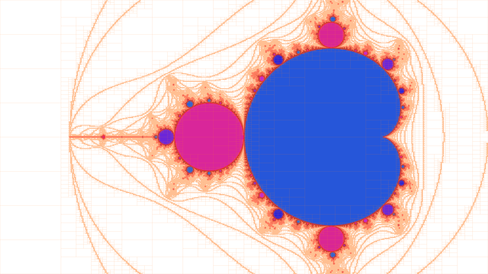

Much better than super-sampling the whole image.

With the final render time brought down by a factor of 140x, anti-aliasing is still the slowest by
far (mariani-silver is nearly instant). There's some more room for optimization with the
anti-aliasing (both with how work is queued and the fairly basic super-sampling technique). GPU
anti-aliasing could also possibly be explored later.

## A Note About Images

The program spits out uncompressed bmp files because that's easy but these can be fairly large. To
compress them (losslessly) use imagemagick's `convert` tool.

## Bug Journal

Here lie a bunch of visually cool results which resulted from failed attempts at solving this
problem.

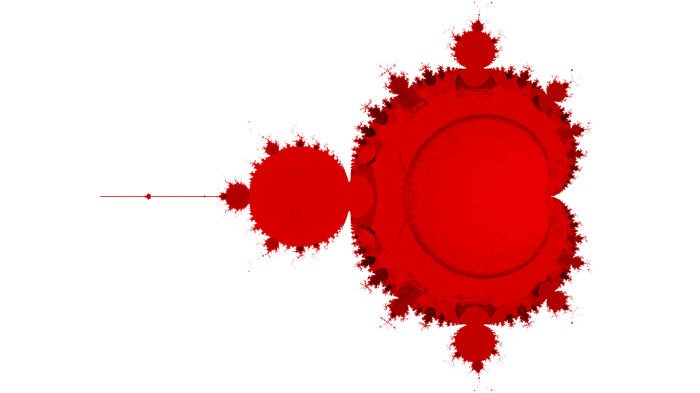

```
k-means with some parameters I've forgotten xD
more kmeans bugs in photos/(bmp|png)/kmeans
```


```
Initial commit
40 iterations
10 seed points
float threshold = min_distance / 2;
max 40 iterations
```

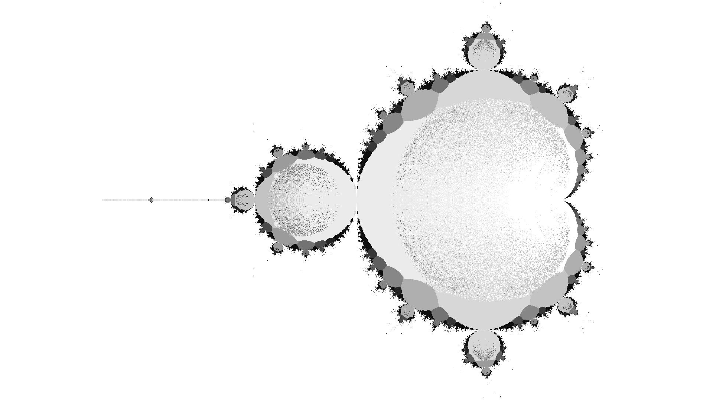

```
Low-iteration low-threshold
```


```
Second commit
40 iterations
10 seed points
any points which escape in the following 40 iterations get colored red
```

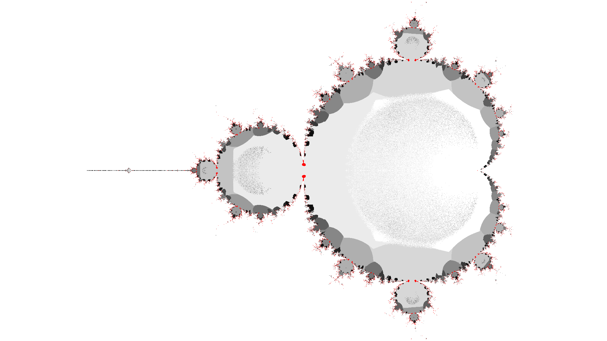

```
Higher-fidelity threshold, third commit
```

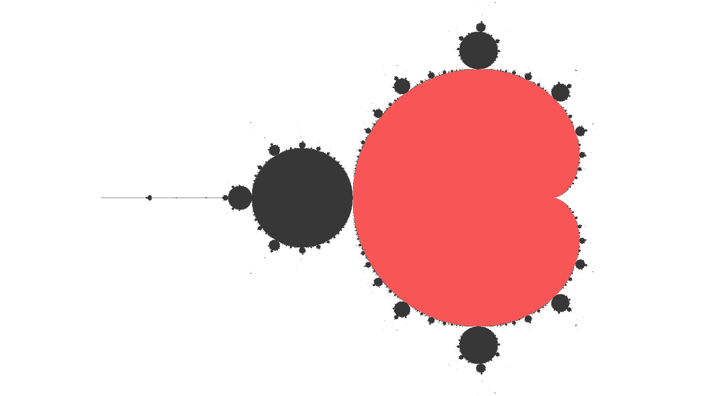

```
Just coloring the main-body with a hard-coded equation
```


```
This was the first semi-successful render
```

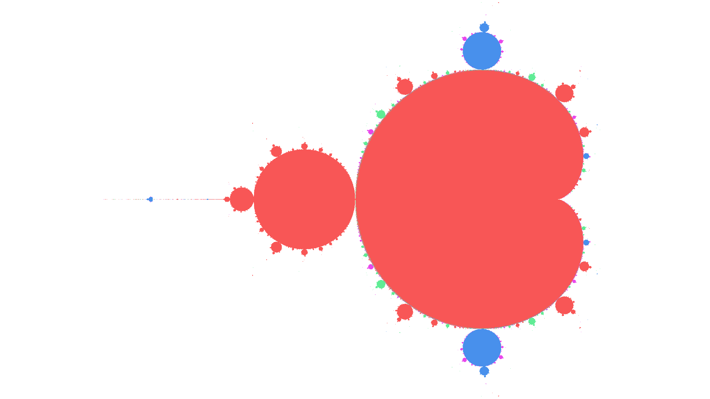

```
A bit more detected but period-detection still buggy
```


```
Iirc here there was an issue with considering points which escaped at 40 iterations as part of the
lambda calculation. The gray anomalies were detected as period 10 (value = 20 * period).
```

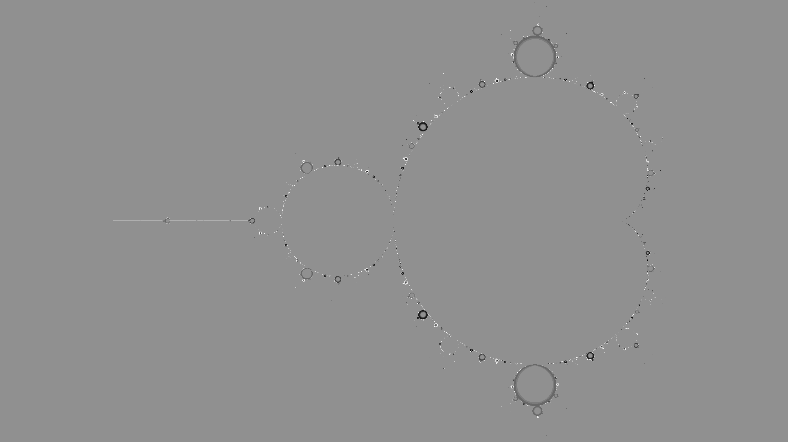

```
I forget what caused this
```


```
I forget what caused this
```

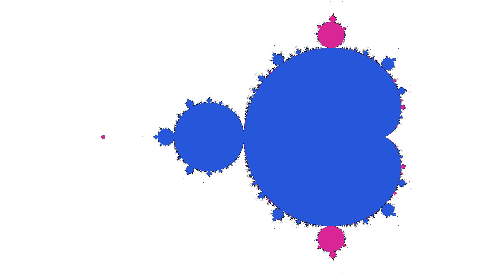

```
For some reason detail was detected but some bulbs didn't detect properly, I forget the reason.
Notice how there are some small bulbs which are two or three colored. Interesting stuff.
```

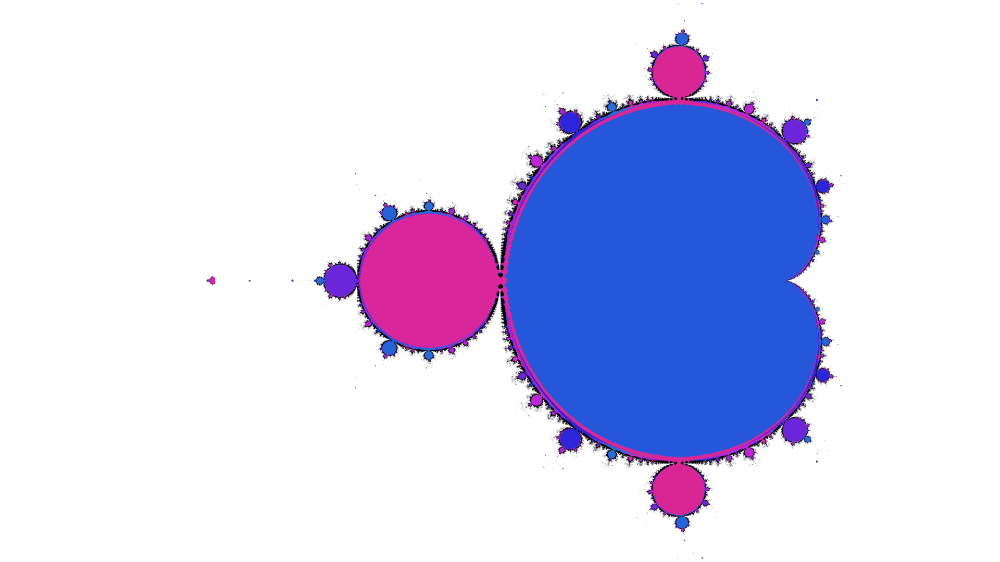

```
Low iteration render. Iterations have to be pretty high for high-resolution renders with this
algorithm in order for points near the edge to converge sufficiently.
```
